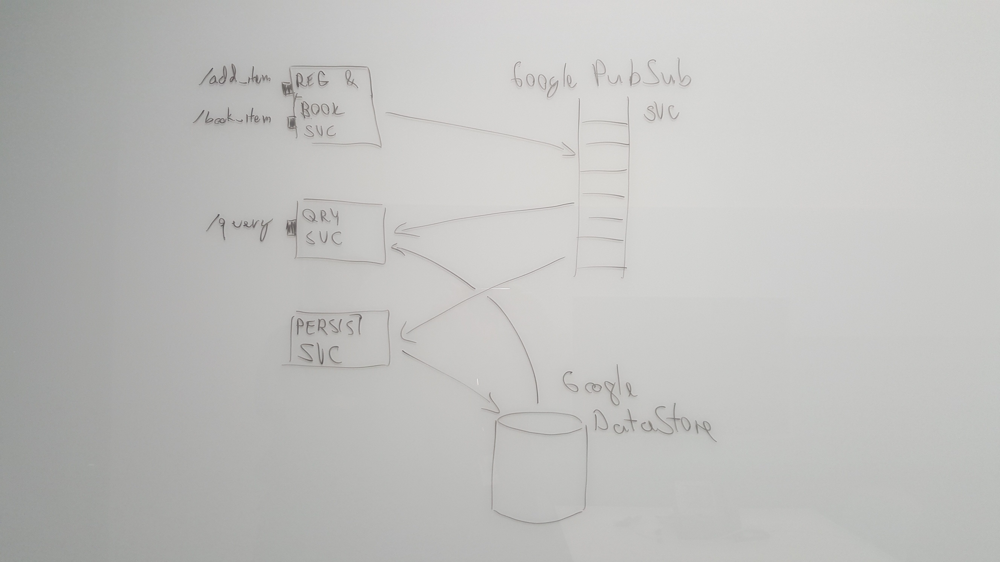

O Hackaton 2016 / Sharing Service
===============================

Sharing service is a service that allows users to:

- offer items (e.g. beamer, car, drum set, ...) for sharing or rental to other
  users
    - an item is offered for a given period, at given location
- query available itms
    - by location, time and category  
- book an offered item
    - booked item shall be withdrawn by the user at given location and returned
      back at the same location in time

The solution attempts to use Event Sourcing & CQRS architectural pattern.
It is separated into 3 micro-services which communicate via Google
Cloud PubSub service (publish subscribe message bus / event sourcing):

- registration & booking service (RegistrationService.go) - command part
    - accepts item registration (offers from users)
    - accepts item booking
    - publishes appropriate messages to "events " topic on the PubSub service
- query service (QueryServiceMain.go) - query part
    - keeps set of active offerings for querying
    - subscribes to "events" topic on the PubSub service
    - updates the state (set of offerings) based on received events
        - the state is maintained in memory only, could be offloaded to some database eventually
    - on startup, it reads the persisted events from data store to reconstruct
      initial state (not implemented yet)
- data storage service (DataStorageService.go) - persistence
    - subscribes to "events" and stores them in Google Cloud Data Store
    - events from the Data Store can be replayed to reconstruct state (not implemented)

The following image illustrates the topology:

Not implemented parts:
- persistence
   - we planned to persist events into Google Cloud Data Store but we are facing
     last minute issues with that
- frontent
   - we planned to implement some basic web front end, but we did not managed to
     do so
   - the service is only available as set of externally available web services
       - curl
- authentication

Testing curl commands:
-------------------------

There are three actions - add_item (offer / register item), book_item and query:

### add_item

    curl "http://104.198.173.92:8081/add_item" --data @add_item.json

where add_item.json file contents is for example:

    {
      "What" : {
        "Category" : "car",
        "Description" : "Tesla Model S"
      },
      "When" : {
        "From" : 1484035200,
        "To" : 1484071200
      },
      "Where": {
        "Location" : "Prague"
      },
      "Who": {
        "Email" : "electron@example.org"
      }
    }

This says to offer Tesla Model S since 8 AM to 6 PM
on 10th January 2017 in Prague.

The response is a number - the ID of meesage on PubSub (it is not important for the client).

### query

Then let's query:

    curl "http://104.154.67.199:8080/query?category=car&location=prague&timeFrom=1484046000&timeTo=1484053200"

We are looking for cars in Prague from 11 AM to 1 PM on 10th January 2017. The query returns json with items,
for example:

    {
      "Items": [
        {
          "Item": {
            "What": {
              "Category": "car",
              "Description": "Tesla Model S"
            },
            "Where": {
              "Location": "Prague"
            },
            "When": {
              "From": 1484035200,
              "To": 1484071200
            },
            "Who": {
              "Email": "electron@example.org"
            }
          },
          "Available": true,
          "Hash": "aaaaakncbMSFyZGX",
          "Timestamp": "1481798551748919623"
        }
      ]
    }

Note that the Tesla Model S that we offered in the first curl is included although
it is shared from 8 AM to 6 PM. The query shall return all the items that could satisfy
requested time; even it they are shared for longer time.

### book_item

Now let's book the item. The `Timestamp` and `Hash` parts of the query result
are used to identify the item. Note that the values will change with each offer.
The booking request will look like:

    curl "http://104.198.173.92:8081/book_item" --data @book_item.json

where book_item.json contents will be:

    {
      "Timestamp": 1481798551748919623,
      "Hash": "aaaaakncbMSFyZGX",
      "Email": "wannadrive@example.com"
    }

The response is for again a number indicating number of message - nothing useful for the client.

We can now check that the item is no longer available; the same query:

    curl "http://104.154.67.199:8080/query?category=car&location=prague&timeFrom=1484046000&timeTo=1484053200"

shall now return empty array:

    {
      "Items": []
    }

Some timestamps may be useful when playing with this.

| Date                     | Timestamp  |
|--------------------------|------------|
| Jan 10 08:00:00 UTC 2017 | 1484035200 |
| Jan 10 09:00:00 UTC 2017 | 1484038800 |
| Jan 10 10:00:00 UTC 2017 | 1484042400 |
| Jan 10 11:00:00 UTC 2017 | 1484046000 |
| Jan 10 12:00:00 UTC 2017 | 1484049600 |
| Jan 10 13:00:00 UTC 2017 | 1484053200 |
| Jan 10 14:00:00 UTC 2017 | 1484056800 |
| Jan 10 15:00:00 UTC 2017 | 1484060400 |
| Jan 10 16:00:00 UTC 2017 | 1484064000 |
| Jan 10 17:00:00 UTC 2017 | 1484067600 |
| Jan 10 18:00:00 UTC 2017 | 1484071200 |

      

